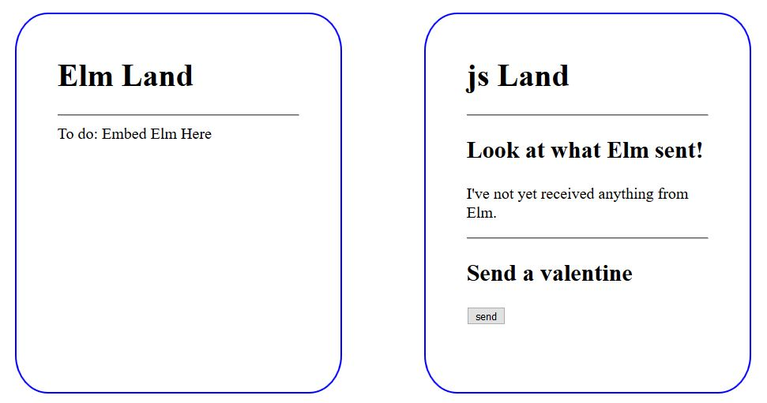
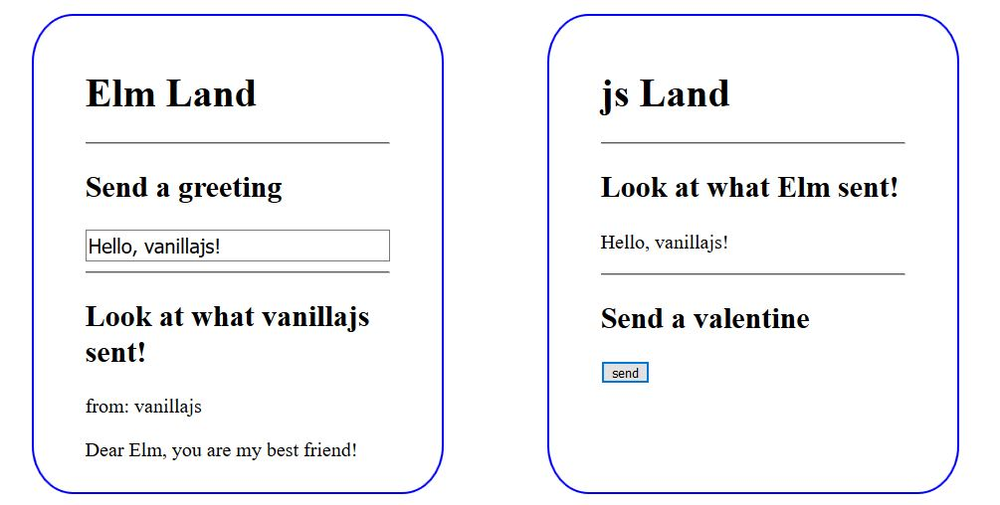

## Introduction

In this tutorial we're going to make a trivial web application. There will not be a back end. The application will consist entirely of one simple webpage that will look like this when we're finished:



Our web page will not do much. It will send a greeting to the div on the right using input from the div on the left. It will display a stock valentine at the bottom of the div on the left whenever the "send" button is clicked in the div on the right. That's it.

A portion of the app is written in Elm, and I've included the Elm code in this repo, but we'll not be writing any Elm as part of the tutorial. Instead we'll be focused entirely entirely on interop between Elm and vanillajs.

## Step 1: Start your webserver and look at what we've got

As I said in the introduction, there is no back-end to this application, so you can run whatever webserver you want. You could even drag index.html into your favorite browser if you like, and work this tutorial entirely through the file protocol.  At this point, our webpage should look like this:




## Step 2: Embed Elm

Elm interop is dead simple. This is the two step process:

1. Embed Elm in your webpage
2. Hook up the ports

We will start by embedding Elm. Open index.html in your favorite text editor, scroll to the bottom-most script tag and uncomment this line:

```javascript
//var elmApp = Elm.FirstInterop.embed(document.getElementById("elm-container"));
```

Save the file, and refresh your browser. The "to do" in the div on the left should be gone now, and the webpage should look ***mostly*** like the image from the introduction.

Elm is now embedded in the webpage. The Elm object in the code above comes from compiled-elm.js and FirstInterop is the name of the module defined in our Elm code. Simple, right?

The greeting input in our webpage does not work yet.  Neither does the "send" button. But they will! All we need to do is finish our two step process by hooking up the ports.

## Step 3: Hook up the ports

There should be two "to do" comments in the script tag just below our call to embed. Right below the first to do, we're going to add some code to hook up the displayGreeting port:

```javascript
elmApp.ports.displayGreeting.subscribe(function(greeting)) {
  document.getElementByID("from-elm").innerHTML = greeting;
});
```

displayGreeting is a port I defined for sending greetings out of Elm. I have chosen to model a greeting as a string, so the displayGreeting port only takes strings. My convention for outgoing ports (outgoing relative to Elm) is to give them command-like names. For outgoing ports, you always receive data by calling subscribe.

That's it for displayGreeting, let's move down to the last to do.  On the line below the to do comment, we're going to add this code:

```
elmApp.ports.valentines.send(valentine);
```

valentines is a port I defined for sending valentines to Elm, and I've defined the port so that only objects with "from" and "content" properties will be allowed through. Valentines is an incoming port (relative to Elm), and my convention for incoming ports is to name them after the type of data that they accept. For incoming ports, you always pass data by calling send.

That's it! Save and refresh and the webpage will now be able to display greetings and send valentines. The app is finished.

## What did we learn?

Hopefully we learned that interoperating with Elm is so simple as to be uninteresting. Elm was designed to make interop with javascript simple. Once you know the two step formula you can follow it anywhere and be a huge success!

## What's next?

Would you like to see interop between Elm and React or Elm and Angular? The adventure continues at these 2 links!

[react interop tutorial](https://jordanwilcken.github.io)

[angular interop tutorial](https://jordanwilcken.github.io)
